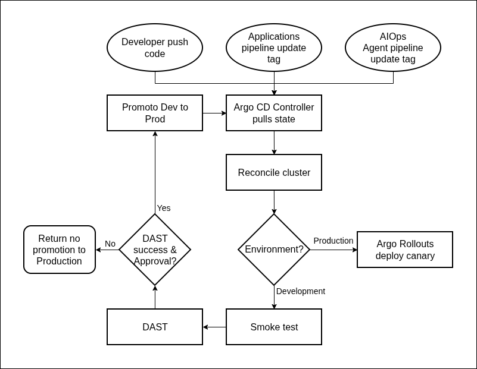

# Nexus GitOps

GitOps source of truth for deploying and operating Kubernetes workloads on
Amazon EKS with Argo CD.

## About

This repository manages the desired state of:

- Application microservices and the AIOps agent
- Vault and External Secrets Operator
- Envoy Gateway and AWS Load Balancer Controller
- Kyverno, Falco, and Argo Rollouts
- Prometheus, Grafana, Loki, Tempo, and OpenTelemetry

This repository contains only the Kubernetes configuration reconciled by Argo CD.

## Sync Waves

Argo CD deploys components in dependency order:

| Wave | Components |
| ---: | --- |
| `-1` | Namespaces |
| `1` | Vault |
| `2` | External Secrets Operator |
| `3` | External Secrets configuration |
| `4` | Kyverno |
| `5` | Kyverno policies |
| `6` | Prometheus stack and AWS Load Balancer Controller |
| `7` | Envoy Gateway, Loki, Tempo, Falco, and production Argo Rollouts |
| `8` | Gateway configuration and OpenTelemetry collectors |
| `9` | Application services and Grafana dashboards |
| `10` | Development AIOps agent |

## Repository Structure

```text
bootstrap/                 Argo CD installation and root Applications
charts/                    Helm charts for application workloads
envs/
  dev/aws/ap-southeast-1/  Development configuration
  prod/aws/ap-southeast-1/ Production configuration
namespaces/                Namespace definitions
platform/                  Shared platform manifests and Helm values
.github/workflows/         Validation, delivery, and promotion workflows
```

## Environments

| Environment | Branch | Delivery strategy |
| --- | --- | --- |
| Development | `main` | Kubernetes Deployment |
| Production | `production` | Argo Rollouts canary |

## Delivery Flow



*GitOps delivery pipeline.*

1. An application repository builds, scans, signs, and publishes an immutable
   container image.
2. Its workflow opens a pull request that updates the development image
   version in this repository.
3. GitOps CI validates the affected Helm chart and Kubernetes configuration.
4. Argo CD reconciles the merged desired state to the development cluster.
5. After development validation, a reviewed pull request promotes the image to
   the `production` branch.
6. Argo Rollouts performs a Prometheus-gated canary deployment in production.

## Quick Start

### Prerequisites

- Helm
- A GitHub App with read access to this repository

### Bootstrap

Create the ignored GitHub App values file, add the App ID, installation ID, and
private key, then bootstrap the target environment:

```bash
cp bootstrap/argocd-github-app-values.yaml.example bootstrap/argocd-github-app-values.yaml
./scripts/bootstrap-argocd.sh <environment> (dev/prod)
```

See [`bootstrap/README.md`](bootstrap/README.md) for detailed configuration and commands.
